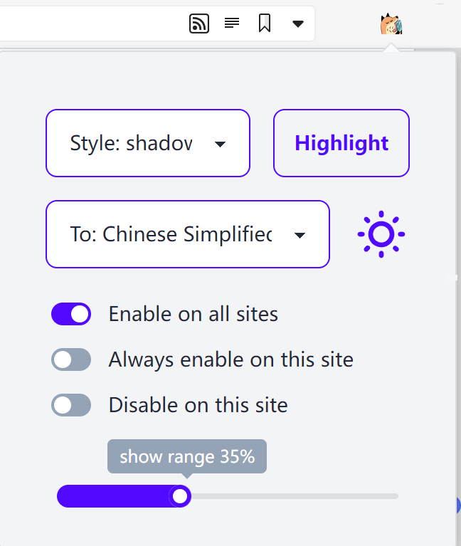

# NEW WORD DISCOVERER

NEW WORD DISCOVERER is inspired by [word-discoverer](https://github.com/mechatroner/word-discoverer). Main purpose of this project is to improve reading experience for non-native speakers. 

According to some observations reading behavior of native and non-native speakers can differ. Also native speakers have a higher probability to spot an unknown word or idiom in text they read. To help users spot new words and increase their vocabulary, rare words in text can be highlighted.

## Install

download from release or

```
npm install && npm run build
```

Go to Chrome Settings using three dots on the top right corner. Then Select Extensions. Click on Load Unpacked and select `dist` folder. Note: You need to select the folder in which the manifest file exists.

NOTE: in vivaldi, set [new-tab-behavior-via-extensions](https://vivaldi.com/blog/new-tab-behavior-via-extensions/)

## Usage

Highlight and collect new words in English articles


Settings can be made on the popup page



review collected words in new tab page


## TODO

- [x] translate api
- [x] popup page
    - [x] select language
    - [x] show range
    - [x] highlight style
    - [x] highlight this page
- [x] add url in white list or black list
- [x] dark mode
- [x] collect words
- [x] show a random word in new tab
- [ ] FIX google no result...
- [ ] change tts
- [ ] FIX page display error in some website
- [ ] customize dictionary