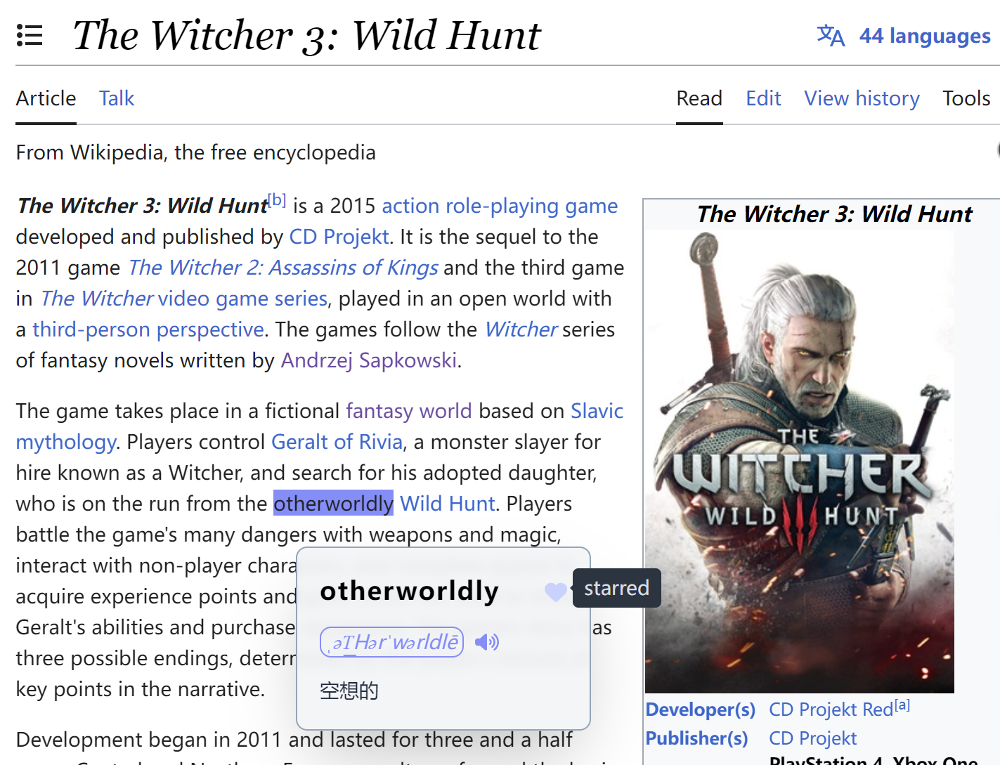
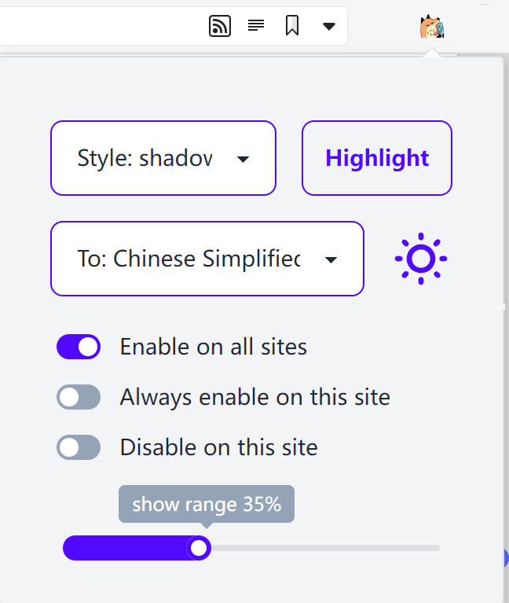
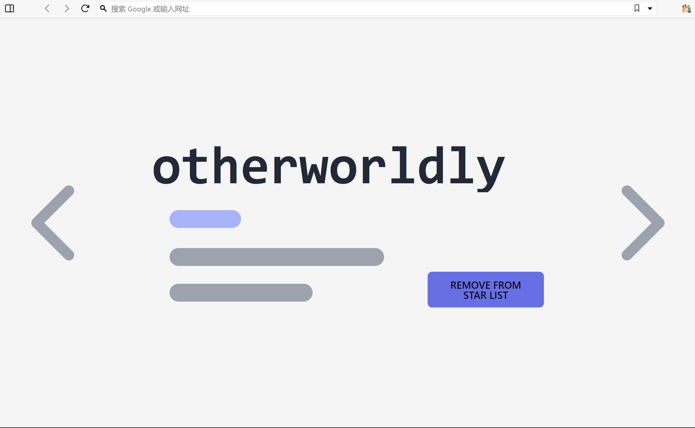

# NEW WORD DISCOVERER

灵感来自 [word-discoverer](https://github.com/mechatroner/word-discoverer)。该项目的目的是改善非母语人士的阅读体验。

根据一些观察，母语者和非母语者的阅读行为可能有所不同。此外，母语使用者在阅读文本时发现未知单词或成语的概率更高。为了帮助用户发现新单词并增加词汇量，可以突出显示文本中的罕见单词。

## 安装

从 release 下载。或者：

```
npm install && npm run build
```

使用右上角的三个点进入 Chrome 浏览器设置。然后选择扩展。点击 “加载解压缩 ”并选择 “dist ”文件夹。注意：需要选择存在 `manifest.json` 文件的文件夹。

在 vivaldi 需要这个设置 [new-tab-behavior-via-extensions](https://vivaldi.com/blog/new-tab-behavior-via-extensions/)

## Usage

高亮的单词可以收藏



点击扩展图标可以进行一些设置



在 new tab 页面可以随机出现一个之前的单词



## TODO

- [x] 翻译接口
- [x] popup 面板，可以进行 highlight style、显示比例的修改
    - [x] 选择语言
    - [x] 比例和 list
    - [x] 选择高亮的样式
    - [x] 高亮本页
- [x] 增加 white black list 逻辑
- [x] 切换 dark light 样式
- [x] 词语收藏和删除接口
- [x] 在 new tab 随机显示收藏的词语
- [x] 手动 dark mode 切换 https://tailwind.docs.73zls.com/docs/dark-mode
- [ ] 增加一个上限
- [ ] FIX google no result...
- [ ] change tts
- [ ] FIX 有些页面导航栏显示不出来 比如说 https://react.i18next.com
- [ ] 添加自定义的词库

## 相关

https://crxjs.dev/vite-plugin
https://github.com/DarinRowe/googletrans
https://daisyui.com